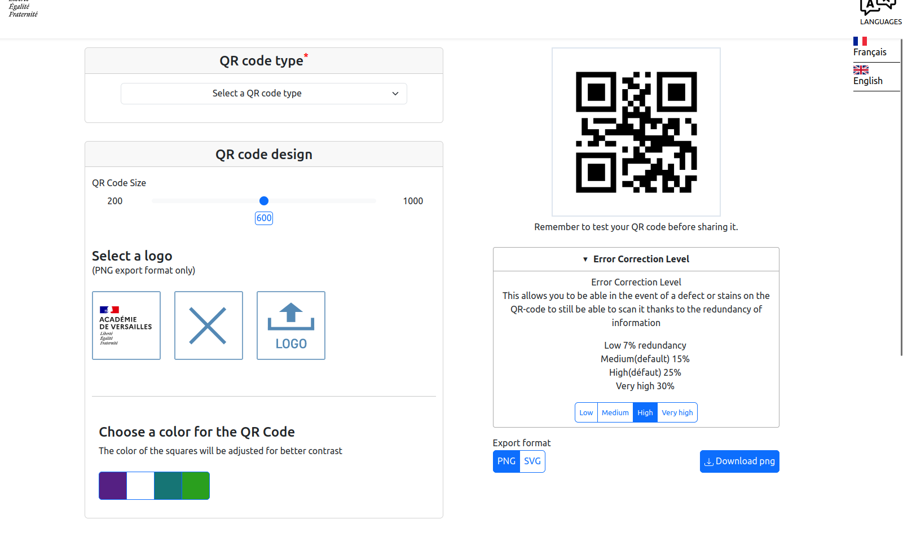

[](LICENSE)

# QR Code Generator

This project was generated with [Angular CLI](https://github.com/angular/angular-cli) version 15.2.5.

The design was made with bootstrap version 5.3.0-alpha3

> The application is a QR code generator that allows you to choose the type of data you want to use. For example, you can generate a vCard or a Wi-Fi access QR code.

## Features

- List of main features of the application.
- For example:
  - Translation of the application in French and English.
  - Choice of the desired QR code type.
  - Generation of QR code from text or URL.
  - Customization of QR code with color and size options.
  - Selection of a logo at the center of the QR code.
  - Choice of export format (SVG or PNG).
  - Selection of error correction level.
  - Download of the generated QR code as an image.

## Screenshots



## Installation

> Instructions for installing and running the application locally.

1. Clone this repository:

   ```bash
   git clone <REPO_URL>
   ```

2. Navigate to the project directory:

   ```bash
   cd qrcode
   ```

3. Install dependencies:

   ```bash
   npm install
   ```

4. Launch the application:
   1. Production server
      ```bash
      ng build
      ```
      > The build artifacts will be stored in the `dist/` directory.

   2. Development server
      ```bash
      ng serve
      ```
      > The application will automatically reload if you change any of the source files.

5. Open your browser and go to the following URL:

   ```text
   http://localhost:4200
   ```

## Configuration

1. Modify or replace header and footer 
   > You can completely customize or remove the header and footer to add your own.

   > To do this, simply modify the `my-header` and `my-footer` components.

   > You can also delete the conponents in `app` conponent HTML 

   > Please note that if you want to keep the translation option, you should include the `my-translate-menu` component in your new header.

2. Add or modify logos
   > You can modify or add logos in `asset/config.ts` in `image_Paths_Logo` var tab
   
   > You can also modify the 2 logos to delete a logo or upload a logo in `asset/config.ts` in `logo_delete` and `logo_upload` 


3. Translate a new word
   > if you want to translate a new word you can in `asset/i18n/<language>.json` add a new field with your word
   
   > example of `json` field 
   ```json
         "REMINDER": "Remember to test your QR code"
      ```
   > then in the HTML code you can just replace your word with:
   ```HTML
         {{REMINDER | translate}} 
      ``` 
4. Add a new form
      > You can create your own form for a new type of QR-code. 

      > You have for that to create a new form conponent(just a basic form with wanted fields) and add it in `my-choice` conponent
      > You will find instructions in comments to help you in `my-choice`

      > To put your data in the QR-code you have to import the service `ServiceQrCode.ts` and change the public value `qrdata` with the data in your form

5. Change the max size of the exported QR-code
      > You can modify this value in `asset/config.ts` in `max_px` 

6. Add or modify colors
      > You can modify or replace a color value in `asset/config.ts` in `colors_tab`
      > be careful with the contrast. 

7. Add a new language
      > To add a new language you need to creat a new json file in `assets/i18n` for exemple you can create a file `es.json` for Spain
      > you have to take an other existing json file and translate value of each keys in spanish in our case.
      > Then you can in `asset/config.ts` in `countries_tab` add a new language. For exemple:
      ```ts
      new Country("Spanish", "es", "../../assets/images/Spanish_flag.svg")
      ```
8. Modify style
      >If you want to change the style of an element you have yo change it in his conponent css file.
      >it can doesn't work but you can then try to change the global style in `/styles.scss`

## Usage

> Instructions on how to use the application.

1. Choose a QR code type from the dropdown menu.
2. Enter the relevant data in the displayed form.
3. Customize the design of your QR code if needed (colors, logo, size).
4. Test your QR code by scanning it.
5. Download your QR code.
6. [Optional] Choose the export format.
7. [Optional] Choose the error correction level.

## Code scaffolding

Run `ng generate component component-name` to generate a new component. You can also use `ng generate directive|pipe|service|class|guard|interface|enum|module`.

## Further help

To get more help on the Angular CLI, use `ng help` or check out the [Angular CLI Overview and Command Reference](https://angular.io/cli) page.

## License

This project is licensed under an open-source license. See the [LICENSE](LICENSE) file for more details.

---